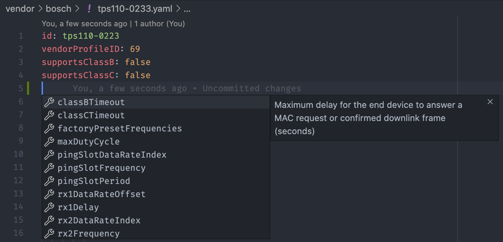

# LoRaWAN Device Repository

The LoRaWAN Device Repository contains information about LoRaWAN end devices. The Device Repository acts as key data source for device catalogs and onboarding devices on LoRaWAN networks.

This repository is a collaborative effort, driven by The Things Network community. We welcome device makers to contribute information about their end devices to help users find and onboard their devices.

## Example

Curious to how end devices, profiles and payload is defined in the Device Repository? [Go to the fully documented example](./vendor/example).

## How-to video

To help you add devices to this repository, you can follow along in this example video where we walk through all of the instructions below.

[](https://www.youtube.com/watch?v=pnwtEgw4f-c)

## Prerequisites

- Node.js version 14.x
- npm version 6.x
- Go version 1.15.x

To check your Node.js, npm and Go versions:

```bash
$ node -v
$ npm -v
$ go version
```

[Download and install Node.js and npm](https://docs.npmjs.com/downloading-and-installing-node-js-and-npm) and [Download Go](https://golang.org/dl/).

Then, install the dependencies:

```bash
$ make deps
```

## Contributing

If you want to submit your devices to the Device Repository, fork this repository and open a pull request. [Learn how to fork and create pull requests](https://docs.github.com/en/free-pro-team@latest/github/collaborating-with-issues-and-pull-requests/creating-a-pull-request).

Pull requests are validated automatically. If there are any validation or formatting errors, the validation checks will not pass, and the pull request will not be merged until those errors are resolved. Therefore, before creating a pull request, run the following action to validate and format your data locally:

```bash
$ make validate fmt
```

## Validation

The Device Repository contains tooling to validate all data against a schema. This is necessary for all data to be loaded automatically in The Things Stack and other services.

To validate data:

```bash
$ make validate
```

[Visual Studio Code](https://code.visualstudio.com/) is a great editor for editing the Device Repository. You can validate your data automatically using the [YAML plugin](https://marketplace.visualstudio.com/items?itemName=redhat.vscode-yaml).

The YAML plugin supports you with filling out the document. When hitting Ctrl + Space, all fields are shown. The Debug Console of Visual Studio provides feedback by highlighting the incorrect fields.



## Files and Directories

There are six file types in the Device Repository:

1. **Vendor index** with a list of vendors (`vendor/index.yaml`)
2. **Vendor device index** with all the devices of a vendor (`vendor/<vendor-id>/index.yaml`)
3. **End device definition** of a single device (`vendor/<vendor-id>/<device-id>.yaml`)
4. **End device profile** for one or more devices (`vendor/<vendor-id>/<profile-id>.yaml`)
5. **Payload codec definition** for one or more devices (`vendor/<vendor-id>/<codec>.yaml`)
6. **Payload codec implementation** to decode and encode payload (`vendor/<vendor-id>/<codec>.js`)

> All files and folders must have lowercase titles.

An example directory structure with a vendor named `company-x` that produces two devices (`device-a` and `device-b`) with the same codec and profile:

```bash
lorawan-devices
├── vendor
│   ├── index.yaml              # vendor index (1)
│   ├── company-x
│   │   ├── index.yaml          # vendor device index (2)
│   │   ├── logo.svg            # vendor logo
│   │   ├── device-a.jpg        # photo of device-a
│   │   ├── device-a.yaml       # device-a definition (3)
│   │   ├── device-b.jpg        # photo of device-b
│   │   ├── device-b.yaml       # device-b definition (3)
│   │   ├── eu868-profile.yaml  # end device profile for EU868 (4)
│   │   ├── codec.js            # payload codec implementation (6)
│   │   └── codec.yaml          # payload codec definition (5)
```

### Vendor Index

First, make sure that your company is listed in the **Vendor index** in `vendor/index.yaml` and that the information is complete.

If your company is not listed or if you want to add additional information, add your information like so:

```yaml
vendors:
  - # Unique identifier of the vendor (lowercase, alphanumeric with dashes, max 36 characters)
    id: company-x
    # Vendor company name
    name: Company X
    # LoRa Alliance issued Vendor ID
    vendorID: 10
    # Vendor website (optional)
    website: https://www.company-x.com
    # Vendor logo filename (optional)
    logo: logo.svg
    # Organization Unique Identifiers (OUIs, six digit hex, optional): http://standards-oui.ieee.org/oui.txt
    # The OUI is typically the first 3 bytes of the DevEUI
    ouis:
      - FCD6BD
    # Private Enterprise Number (optional): https://www.iana.org/assignments/enterprise-numbers/enterprise-numbers
    pen: 42
```

The vendor data will be in the `vendor/<vendor-id>` folder (e.g. `vendor/company-x`). Create the folder if it does not exist yet.

### Vendor Device Index

All vendor data is referenced from the **Vendor device index** file: `vendor/<vendor-id>/index.yaml`:

```yaml
endDevices:
  - device-a
  - device-b
```

All end device identifiers must be lowercase, alphanumeric with dashes and max 36 characters.

### End Device

For each end device, create an **End device definition** file with the same filename as the identifier in the index: `vendor/<vendor-id>/<device-id>.yaml`:

```yaml
name: Device A
description: My first LoRaWAN device

# Firmware versions (at least one is mandatory)
firmwareVersions:
  - # Firmware version
    version: '1.0'
    # LoRaWAN Device Profiles per region
    # Supported regions: EU863-870, US902-928, AU915-928, AS923, CN779-787, EU433, CN470-510, KR920-923, IN865-867, RU864-870
    profiles:
      EU863-870:
        # Unique identifier of the profile (lowercase, alphanumeric with dashes, max 36 characters)
        id: device-a-profile
        lorawanCertified: true
        codec: device-a-codec
      US902-928:
        id: device-a-profile
        lorawanCertified: true
        codec: device-a-codec
```

There are many other fields that can be set: hardware versions, firmware versions, sensors, dimensions, weight, battery information, operating conditions, IP code, security information, photos and regulatory and compliancy information. See [Example Wind Sensor](./vendor/example/windsensor.yaml) for a full example.

> **NOTE** It is highly recommended to fill out as many information about the end devices as possible. The definition above is the bare minimum information.

### End Device Profile

Each referenced end device profile needs to be defined in the **End device profile**, with the same filename as the profile ID: `vendor/<vendor-id>/<profile-id>.yaml`:

```yaml
# Vendor profile ID, can be freely issued by the vendor
# This vendor profile ID is also used on the QR code for LoRaWAN devices, see
# https://lora-alliance.org/sites/default/files/2020-10/LoRa_Alliance_Vendor_ID_for_QR_Code.pdf
vendorProfileID: 42

# LoRaWAN MAC version: 1.0, 1.0.1, 1.0.2, 1.0.3, 1.0.4 or 1.1
macVersion: 1.0.3
# LoRaWAN Regional Parameters version. Values depend on the LoRaWAN version:
#   1.0:   TS001-1.0
#   1.0.1: TS001-1.0.1
#   1.0.2: RP001-1.0.2 or RP001-1.0.2-RevB
#   1.0.3: RP001-1.0.3-RevA
#   1.0.4: RP002-1.0.0 or RP002-1.0.1
#   1.1:   RP001-1.1-RevA or RP001-1.1-RevB
regionalParametersVersion: RP001-1.0.3-RevA

# Whether the end device supports join (OTAA) or not (ABP)
supportsJoin: true
# If your device is an ABP device (supportsJoin is false), uncomment the following fields:
# RX1 delay
#rx1Delay: 5
# RX1 data rate offset
#rx1DataRateOffset: 0
# RX2 data rate index
#rx2DataRateIndex: 0
# RX2 frequency (MHz)
#rx2Frequency: 868.525
# Factory preset frequencies (MHz)
#factoryPresetFrequencies: [868.1, 868.3, 868.5, 867.1, 867.3, 867.5, 867.7, 867.9]

# Maximum EIRP
maxEIRP: 16
# Whether the end device supports 32-bit frame counters
supports32bitFCnt: true

# Whether the end device supports class B
supportsClassB: false
# If your device supports class B, uncomment the following fields:
# Maximum delay for the end device to answer a MAC request or confirmed downlink frame (seconds)
#classBTimeout: 60
# Ping slot period (seconds)
#pingSlotPeriod: 128
# Ping slot data rate index
#pingSlotDataRateIndex: 0
# Ping slot frequency (MHz). Set to 0 if the band supports ping slot frequency hopping.
#pingSlotFrequency: 869.525

# Whether the end device supports class C
supportsClassC: false
# If your device supports class C, uncomment the following fields:
# Maximum delay for the end device to answer a MAC request or confirmed downlink frame (seconds)
#classCTimeout: 60
```

For more information and for fields for ABP, see [LoRaWAN Schema: Devices Draft 1](https://lorawan-schema.org/draft/devices/1/).

### Payload Codecs

The Device Repository supports three payload codecs to be defined:

1. Uplink decoder: decodes binary data uplink into a JSON object
2. Downlink encoder: decodes a JSON object into binary data downlink
3. Downlink decoder: decodes an encoded binary data downlink back into a JSON object (must be symmetric with the downlink encoder)

The codecs can all be defined in one file as they are defined by their function names. The codecs must be written in JavaScript (ECMAScript 5.1+). [See link](https://thethingsstack.io/integrations/payload-formatters/javascript/ for instructions on how to write decoders and encoders.

The codecs are defined in the **Payload codec definition** file, with the same filename as the codec ID: `vendor/<vendor-id>/<codec>.yaml`:

```yaml
# Uplink decoder decodes binary data uplink into a JSON object (optional)
# For documentation on writing encoders and decoders, see: https://thethingsstack.io/integrations/payload-formatters/javascript/
uplinkDecoder:
  fileName: codec.js
  # Examples (optional)
  examples:
    - description: 32 knots from the North
      input:
        fPort: 1
        bytes: [0, 32]
      output:
        data:
          direction: 'N'
          speed: 32
# Downlink encoder encodes JSON object into a binary data downlink (optional)
downlinkEncoder:
  fileName: codec.js
  # Examples (optional)
  examples:
    - description: Turn green
      input:
        data:
          led: green
      output:
        bytes: [1]
        fPort: 2
# Downlink decoder decodes the encoded downlink message (optional, must be symmetric with downlinkEncoder)
downlinkDecoder:
  fileName: codec.js
  # Examples (optional)
  examples:
    - description: Turn green
      input:
        fPort: 2
        bytes: [1]
      output:
        data:
          led: green
```

The actual **Payload codec implementation** is in the referenced filename: `vendor/<vendor-id>/<codec-filename>`.

An example codec for a wind direction and speed sensor with controllable LED looks like this:

```js
var directions = ["N", "E", "S", "W"];
var colors = ["red", "green"];

// input = { fPort: 1, bytes: [1, 62] }
function decodeUplink(input) {
  switch (input.fPort) {
  case 1:
    return {
      // Decoded data
      data: {
        direction: directions[input.bytes[0]],
        speed: input.bytes[1]
      }
    }
  default:
    return {
      errors: ["unknown FPort"]
    }
  }
}

// input = { data: { led: "green" } }
function encodeDownlink(input) {
  var i = colors.indexOf(input.data.led);
  if (i === -1) {
    return {
      errors: ["invalid LED color"]
    }
  }
  return {
    // LoRaWAN FPort used for the downlink message
    fPort: 2,
    // Encoded bytes
    bytes: [i]
  }
}

// input = { fPort: 2, bytes: [1] }
function decodeDownlink(input) {
  switch (input.fPort) {
  case 2:
    return {
      // Decoded downlink (must be symmetric with encodeDownlink)
      data: {
        led: colors[input.bytes[0]]
      }
    }
  default:
    return {
      errors: ["invalid FPort"]
    }
  }
}
```

#### Errors and Warnings

Scripts can return warnings and errors to inform the application layer of potential issues with the data or indicate that the payload is malformatted.

The warnings and errors are string arrays. If there are any errors, the message fails. Any warnings are added to the message.

Example warning:

```js
// input = { fPort: 1, bytes: [1, 2, 3] }
function decodeUplink(input) {
  var warnings = [];
  var battery = input.bytes[0] << 8 | input.bytes[1];
  if (battery < 2000) {
    warnings.push("unreliable battery level");
  }
  return {
    // Decoded data
    data: {
      battery: battery
    },
    // Warnings
    warnings: warnings
  }
}
```

Example error:

```js
function encodeDownlink(input) {
  if (typeof input.data.gate !== 'boolean') {
    return {
      errors: [
        "missing required field: gate"
      ]
    }
  }
  return {
    fPort: 1,
    bytes: [input.data.gate ? 1 : 0]
  }
}
```

## Legal

The API is distributed under [Apache License, Version 2.0](https://www.apache.org/licenses/LICENSE-2.0). See `LICENSE` for more information.

All product names, logos, and brands are property of their respective owners. All company, product and service names used in the Device Repository are for identification purposes only. Use of these names, logos, and brands does not imply endorsement.
