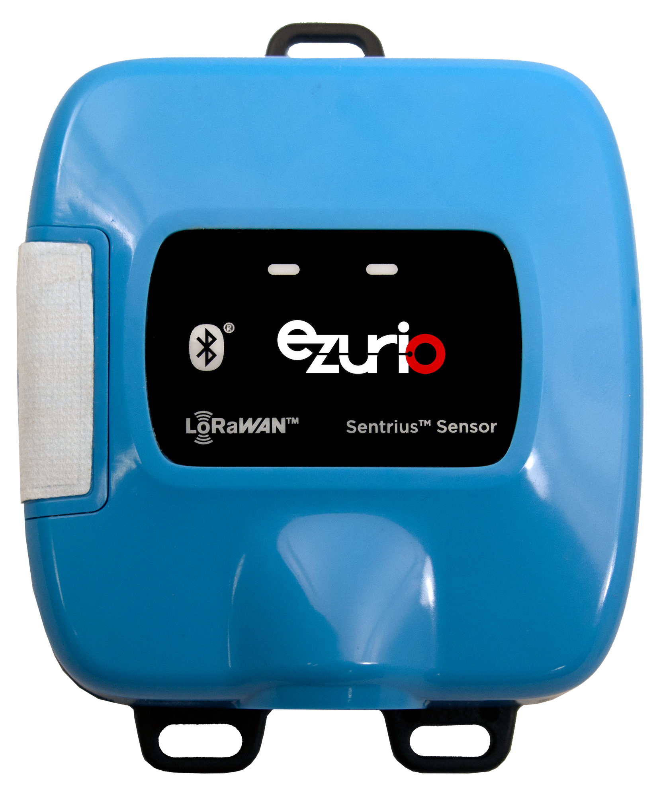

# RS1XX - TTI Codec Pack

These are the downlink decoder and encoder and uplink decoder [Payload Formatters] for the RS1xx series of LoRa Sensors.

The content is managed by TTI and resides at the [TTI Device Repository Github Page].

All available models are supported, refer to the appropriate product brief as follows.

| Variant                                   | Product Brief                                           |
|-------------------------------------------|---------------------------------------------------------|
| External RTD Temp Probe                   |[External RTD Temp Probe Product Brief]                  |
| External Temp Sensor                      |[External Temp Sensor Product Brief]                     |
| Integrated Temp & Humidity Sensor         |[Integrated Temp & Humidity Sensor Product Brief]        |
| Open/Closed Sensor and Integrated Temp/RH |[Open/Closed Sensor and Integrated Temp/RH Product Brief]|

The codecs are intended to be used in conjunction with the [RS1XX Configuration Guide] and appropriate User guide, as follows.

| Variant                                   | User Guide                                          |
|-------------------------------------------|-----------------------------------------------------|
| External RTD Temp Probe                   |[RS1XX External Temperature Sensors User Guide]      |
| External Temp Sensor                      |[RS1XX External Temperature Sensors User Guide]      |
| Integrated Temp & Humidity Sensor         |[RS1XX Open/Closed and Integrated Temp/RH User Guide]|
| Open/Closed Sensor and Integrated Temp/RH |[RS1XX Open/Closed and Integrated Temp/RH User Guide]|

The [RS1XX Protocol Specification] should be referred to for details of limits applied to data values.

# Using the codecs

Refer to the [TTI Device Repository] for further details of usage.

# Downlink Encoding

The following downlink message types can be encoded and decoded.

|              Command                         | External RTD Temp Probe | External Temp Sensor | Integrated Temp & Humidity Sensor | Open/Closed Sensor and Integrated Temp/RH |
|----------------------------------------------|-------------------------|----------------------|-----------------------------------|-------------------------------------------|
| Generic Data Retrieval Notification          | Yes                     | Yes                  | Yes                               | Yes                                       |
| Set UTC Notification                         | Yes                     | Yes                  | Yes                               | Yes                                       |
| Sensor Config Notification                   | No                      | Yes                  | Yes                               | Yes                                       |
| Heater Control Notification                  | No                      | No                   | Yes                               | Yes                                       |
| Backoff Notification                         | Yes                     | Yes                  | Yes                               | Yes                                       |
| FIFO Backlog Retrieval Notification          | Yes                     | Yes                  | Yes                               | Yes                                       |
| Format Flash Log Notification                | Yes                     | Yes                  | Yes                               | Yes                                       |
| LIFO Backlog Retrieval Notification          | Yes                     | Yes                  | Yes                               | Yes                                       |
| Cancel Backlog Retrieval                     | Yes                     | Yes                  | Yes                               | Yes                                       |
| Open/Closed Config Notification              | No                      | No                   | No                                | Yes                                       |
| RTD Sensor Config Notification               | Yes                     | No                   | No                                | No                                        |
| FIFO Targeted Backlog Retrieval Notification | Yes                     | Yes                  | Yes                               | Yes                                       |
| LIFO Targeted Backlog Retrieval Notification | Yes                     | Yes                  | Yes                               | Yes                                       |

## Generic Data Retrieval Notification

This is used to trigger an action within the sensor. The message content is as follows.

    {
        msgType: "genericDataRetrieval",
        options: one of Downlink Options
    }

[Downlink Options](#downlink-options)

## Set UTC Notification

This sets the UTC value in the sensor.

### Applicability

| Variant                                   | Applicable |
|-------------------------------------------|------------|
| External RTD Temp Probe                   | Yes        |
| External Temp Sensor                      | Yes        |
| Integrated Temp & Humidity Sensor         | Yes        |
| Open/Closed Sensor and Integrated Temp/RH | Yes        |

### Structure

    {
        msgType: "generateRTCDownlink",
        options: one of Downlink Options,
        year: the year to set the UTC to,
        month: one of Months,
        day: the calendar day to set the UTC to,
        hours: the 24 hour clock to set the UTC hours to,
        minutes: the minutes value to set the UTC to,
        seconds: the seconds value to set the UTC to
    }

[Downlink Options](#downlink-options)

[Months](#months)

## Sensor Config Notification

This configures the sensor.

### Applicability

| Variant                                   | Applicable |
|-------------------------------------------|------------|
| External RTD Temp Probe                   | No         |
| External Temp Sensor                      | Yes        |
| Integrated Temp & Humidity Sensor         | Yes        |
| Open/Closed Sensor and Integrated Temp/RH | Yes        |

Refer to [RTD Sensor Config Notification](#rtd-sensor-config-notification) for the equivalent command for the External RTD Temp Probe variant.

### Structure

    {
        msgType: "config",
        options: one of Downlink Options,
        batteryType: one of Battery Type,
        sensorReadPeriod: the number of seconds between each sensor update,
        sensorAggregate: the number of sensor readings per uplink,
        tempAlarmsEnabled: one of Boolean,
        humidityAlarmsEnabled: one of Boolean,
        tempAlarmLimitLow: the low temperature alarm limit threshold,
        tempAlarmLimitHigh: the high temperature alarm limit threshold,
        humidityAlarmLimitLow: the low humidity alarm limit threshold,
        humidityAlarmLimitHigh: the high humidity alarm limit threshold,
        ledBle: the number of seconds between each flash of the BLE LED,
        ledLora: the number of seconds between each flash of the LoRa LED
    }

[Battery Type](#battery-type)

[Downlink Options](#downlink-options)

[Boolean](#boolean)

## Heater Control Notification

### Applicability

| Variant                                   | Applicable |
|-------------------------------------------|------------|
| External RTD Temp Probe                   | No         |
| External Temp Sensor                      | No         |
| Integrated Temp & Humidity Sensor         | Yes        |
| Open/Closed Sensor and Integrated Temp/RH | Yes        |

### Structure

    {
        msgType: "heaterControl",
        options: one of Downlink Options,
        heaterSetting: the desired heater current,
        heaterTime: the number of milliseconds to enable the heater for
    }

[Downlink Options](#downlink-options)

## Backoff Notification

### Applicability

| Variant                                   | Applicable |
|-------------------------------------------|------------|
| External RTD Temp Probe                   | Yes        |
| External Temp Sensor                      | Yes        |
| Integrated Temp & Humidity Sensor         | Yes        |
| Open/Closed Sensor and Integrated Temp/RH | Yes        |

### Structure

    {
        msgType: "backoff",
        options: one of Downlink Options,
        backoffPeriod: the number of seconds to the back the sensor off
    }

[Downlink Options](#downlink-options)

## FIFO Backlog Retrieval Notification

### Applicability

| Variant                                   | Applicable |
|-------------------------------------------|------------|
| External RTD Temp Probe                   | Yes        |
| External Temp Sensor                      | Yes        |
| Integrated Temp & Humidity Sensor         | Yes        |
| Open/Closed Sensor and Integrated Temp/RH | Yes        |

### Structure

    {
        msgType: "asRequestBacklogFIFO",
        options: one of Downlink Options,
        backlogPullReqNum: the number of backlogs to retrieve,
        backlogPullReqPeriod: the rate in seconds at which backlogs are retrieved
    }

[Downlink Options](#downlink-options)

## Format Flash Log Notification

### Applicability

| Variant                                   | Applicable |
|-------------------------------------------|------------|
| External RTD Temp Probe                   | Yes        |
| External Temp Sensor                      | Yes        |
| Integrated Temp & Humidity Sensor         | Yes        |
| Open/Closed Sensor and Integrated Temp/RH | Yes        |

### Structure

    {
        msgType: "asFormatFlash",
        options: one of Downlink Options
    }

[Downlink Options](#downlink-options)

## LIFO Backlog Retrieval Notification

### Applicability

| Variant                                   | Applicable |
|-------------------------------------------|------------|
| External RTD Temp Probe                   | Yes        |
| External Temp Sensor                      | Yes        |
| Integrated Temp & Humidity Sensor         | Yes        |
| Open/Closed Sensor and Integrated Temp/RH | Yes        |

### Structure

    {
        msgType: "asRequestBacklogLIFO",
        options: one of Downlink Options,
        backlogPullReqNum: the number of backlogs to retrieve,
        backlogPullReqPeriod: the rate in seconds at which backlogs are retrieved
    }

[Downlink Options](#downlink-options)

## Cancel Backlog Retrieval

### Applicability

| Variant                                   | Applicable |
|-------------------------------------------|------------|
| External RTD Temp Probe                   | Yes        |
| External Temp Sensor                      | Yes        |
| Integrated Temp & Humidity Sensor         | Yes        |
| Open/Closed Sensor and Integrated Temp/RH | Yes        |

### Structure

    {
        msgType: "asCancelBacklogRetrieval",
        options: one of Downlink Options
    }

[Downlink Options](#downlink-options)

## Open/Closed Config Notification

### Applicability

| Variant                                   | Applicable |
|-------------------------------------------|------------|
| External RTD Temp Probe                   | No         |
| External Temp Sensor                      | No         |
| Integrated Temp & Humidity Sensor         | No         |
| Open/Closed Sensor and Integrated Temp/RH | Yes        |

### Structure

    {
        msgType: "asSetOpenClosedConfig",
        options: one of Downlink Options,
        operatingMode: one of Operating Mode,
        loraNotificationOptions: one or more of LoRa Notification Options,
        openDwellTime: the number of seconds the external sensor must be open before annunciating the Open state,
        closedDwellTime: the number of seconds the external sensor must be closed before annunciating the Closed state, 
        resendInterval: the number of seconds between each external sensor uplink message,
        debounceAdjust: the number of milliseconds between successive reads of the external sensor to determine its state
    }

[Downlink Options](#downlink-options)

[Operating Mode](#operating-mode)

[LoRa Notification Options](#lora-notification-options)

## RTD Sensor Config Notification

### Applicability

| Variant                                   | Applicable |
|-------------------------------------------|------------|
| External RTD Temp Probe                   | Yes        |
| External Temp Sensor                      | No         |
| Integrated Temp & Humidity Sensor         | No         |
| Open/Closed Sensor and Integrated Temp/RH | No         |

### Structure

    {
        msgType: "rtdConfig",
        options: one of Downlink Options,
        batteryType: one of Battery Type,
        sensorReadPeriod: the number of seconds between each sensor update,
        sensorAggregate: the number of sensor readings per uplink,
        tempAlarmsEnabled: one of Boolean,
        tempAlarmLimitLow: the low temperature alarm limit threshold,
        tempAlarmLimitHigh: the high temperature alarm limit threshold,
        ledBle: the number of seconds between each flash of the BLE LED,
        ledLora: the number of seconds between each flash of the LoRa LED
    }

[Battery Type](#battery-type)

[Downlink Options](#downlink-options)

[Boolean](#boolean)

## FIFO Targeted Backlog Retrieval Notification

### Applicability

| Variant                                   | Applicable |
|-------------------------------------------|------------|
| External RTD Temp Probe                   | Yes        |
| External Temp Sensor                      | Yes        |
| Integrated Temp & Humidity Sensor         | Yes        |
| Open/Closed Sensor and Integrated Temp/RH | Yes        |

### Structure

    {
        msgType: "asRequestTargetedBacklogFIFO",
        options: one of Downlink Options,
        startYear: the year to start retrieval for,
        startMonth: the month to start retrieval for,
        startDay: the calendar day to start retrieval for,
        startHours: the 24 hour clock hours to start retrieval for,
        startMinutes: the minutes value to start retrieval for,
        startSeconds: the seconds value to start retrieval for,
        endYear: the year to end retrieval for,
        endMonth: the month to end retrieval for,
        endDay: the calendar day to end retrieval for,
        endHours: the 24 hour clock hours to end retrieval for,
        endMinutes: the minutes value to end retrieval for,
        endSeconds: the seconds value to end retrieval for,
        backlogPullReqPeriod: the number of seconds between each backlog uplink
    }

[Downlink Options](#downlink-options)

[Months](#months)

## LIFO Targeted Backlog Retrieval Notification

### Applicability

| Variant                                   | Applicable |
|-------------------------------------------|------------|
| External RTD Temp Probe                   | Yes        |
| External Temp Sensor                      | Yes        |
| Integrated Temp & Humidity Sensor         | Yes        |
| Open/Closed Sensor and Integrated Temp/RH | Yes        |

### Structure

    {
        msgType: "asRequestTargetedBacklogLIFO",
        options: one of Downlink Options,
        startYear: the year to start retrieval for,
        startMonth: the month to start retrieval for,
        startDay: the calendar day to start retrieval for,
        startHours: the 24 hour clock hours to start retrieval for,
        startMinutes: the minutes value to start retrieval for,
        startSeconds: the seconds value to start retrieval for,
        endYear: the year to end retrieval for,
        endMonth: the month to end retrieval for,
        endDay: the calendar day to end retrieval for,
        endHours: the 24 hour clock hours to end retrieval for,
        endMinutes: the minutes value to end retrieval for,
        endSeconds: the seconds value to end retrieval for,
        backlogPullReqPeriod: the number of seconds between each backlog uplink
    }

[Downlink Options](#downlink-options)

[Months](#months)

# Uplink Decoding

The following uplink messages can be decoded.

|              Command                          | External RTD Temp Probe | External Temp Sensor | Integrated Temp & Humidity Sensor | Open/Closed Sensor and Integrated Temp/RH |
|-----------------------------------------------|-------------------------|----------------------|-----------------------------------|-------------------------------------------|
| Send Temp RH Data Notification                | No                      | Yes                  | Yes                               | Yes                                       |
| Send Temp and RH Aggregated Data Notification | Yes                     | Yes                  | Yes                               | Yes                                       |
| Send Backlog Message Notification             | Yes                     | Yes                  | Yes                               | Yes                                       |
| Send Backlog Messages Notification            | Yes                     | Yes                  | Yes                               | Yes                                       |
| Send Sensor Config Simple Notification        | Yes                     | Yes                  | Yes                               | Yes                                       |
| Send Sensor Config Advanced Notification      | No                      | Yes                  | Yes                               | Yes                                       |
| Send FW Version Notification                  | Yes                     | Yes                  | Yes                               | Yes                                       |
| Send Open Closed Config Notification          | No                      | No                   | No                                | Yes                                       |
| Send Open Closed Status Notification          | No                      | No                   | No                                | Yes                                       |
| Send Battery Voltage                          | Yes                     | Yes                  | Yes                               | Yes                                       |
| Send RTD Data Notification                    | Yes                     | No                   | No                                | No                                        |
| Send RTD Config Advanced Notification         | Yes                     | No                   | No                                | No                                        |

## Send Temp RH Data Notification

### Applicability

| Variant                                   | Applicable |
|-------------------------------------------|------------|
| External RTD Temp Probe                   | No         |
| External Temp Sensor                      | Yes        |
| Integrated Temp & Humidity Sensor         | Yes        |
| Open/Closed Sensor and Integrated Temp/RH | Yes        |

### Structure

    {
        msgType: "Laird_Internal_TH",
        options: one or more of Uplink Options,
        batteryCapacity: one of Battery Capacity,
        temperature: the sensor temperature value,
        humidity: the sensor humidity value,
        alarmMsgCount: the number of alarm messages currently stored,
        backlogMsgCount: the number of backlog messages currently stored
    }

[Uplink Options](#uplink-options)

[Battery Capacity](#battery-capacity)

## Send Temp and RH Aggregated Data Notification

### Applicability

| Variant                                   | Applicable |
|-------------------------------------------|------------|
| External RTD Temp Probe                   | Yes        |
| External Temp Sensor                      | Yes        |
| Integrated Temp & Humidity Sensor         | Yes        |
| Open/Closed Sensor and Integrated Temp/RH | Yes        |

### Structure (External Temp Sensor, Integrated Temp & Humidity Sensor, Open/Closed Sensor and Integrated Temp/RH)

    {
        msgType: "Laird_Agg_TH",
        options: one or more of Uplink Options,
        batteryCapacity: one of Battery Capacity,
        alarmMsgCount: the number of alarm messages currently stored,
        backlogMsgCount: the number of backlog messages currently stored,
        numberOfReadings: the number of readings in the message,
        timestamp: {
            year: the year associated with the last sensor reading,
            month: the month associated with the last sensor reading,
            day: the day associated with the last sensor reading,
            hours: the hour associated with the last sensor reading,
            minutes: the minute associated with the last sensor reading,
            seconds: the second associated with the last sensor reading,
        },
        readings: [
            temperature: the sensor temperature value,
            humidity: the sensor humidity value
        ],
    }
### Structure (External RTD Temp Probe)

    {
        msgType: "Laird_Agg_TH",
        options: one or more of Uplink Options,
        batteryCapacity: one of Battery Capacity,
        alarmMsgCount: the number of alarm messages currently stored,
        backlogMsgCount: the number of backlog messages currently stored,
        numberOfReadings: the number of readings in the message,
        timestamp: {
            year: the year associated with the last sensor reading,
            month: the month associated with the last sensor reading,
            day: the day associated with the last sensor reading,
            hours: the hour associated with the last sensor reading,
            minutes: the minute associated with the last sensor reading,
            seconds: the second associated with the last sensor reading,
        },
        readings: [
            temperature: the sensor temperature value,
        ],
    }

[Uplink Options](#uplink-options)

[Battery Capacity](#battery-capacity)

[Months](#months)

## Send Backlog Message Notification

### Applicability

| Variant                                   | Applicable |
|-------------------------------------------|------------|
| External RTD Temp Probe                   | Yes        |
| External Temp Sensor                      | Yes        |
| Integrated Temp & Humidity Sensor         | Yes        |
| Open/Closed Sensor and Integrated Temp/RH | Yes        |

### Structure (External Temp Sensor, Integrated Temp & Humidity Sensor, Open/Closed Sensor and Integrated Temp/RH)

    {
        msgType: "SendBackLogMessage",
        options: one or more of Uplink Options,
        timestamp: {
            year: the year associated with the backlog message,
            month: the month associated with the backlog message,
            day: the day associated with the backlog message,
            hours: the hour associated with the backlog message,
            minutes: the minute associated with the backlog message,
            seconds: the second associated with the backlog message,
        },
        temperature: the sensor temperature value,
        humidity: the sensor humidity value
    }
### Structure (External RTD Temp Probe)

    {
        msgType: "SendBackLogMessage",
        options: one or more of Uplink Options,
        timestamp: {
            year: the year associated with the backlog message,
            month: the month associated with the backlog message,
            day: the day associated with the backlog message,
            hours: the hour associated with the backlog message,
            minutes: the minute associated with the backlog message,
            seconds: the second associated with the backlog message,
        },
        temperature: the sensor temperature value
    }

[Uplink Options](#uplink-options)

[Months](#months)

## Send Backlog Messages Notification

### Applicability

| Variant                                   | Applicable |
|-------------------------------------------|------------|
| External RTD Temp Probe                   | Yes        |
| External Temp Sensor                      | Yes        |
| Integrated Temp & Humidity Sensor         | Yes        |
| Open/Closed Sensor and Integrated Temp/RH | Yes        |

### Structure (External Temp Sensor, Integrated Temp & Humidity Sensor, Open/Closed Sensor and Integrated Temp/RH)

    {
        msgType: "SendBackLogMessages",
        options: one or more of Uplink Options,
        numberOfReadings: the number of readings in the message,
        readings: [
            timestamp :{
                year: the year associated with the reading,
                month: the month associated with the reading,
                day: the day associated with the reading,
                hours: the hour associated with the reading,
                minutes: the minute associated with the reading,
                seconds: the second associated with the reading,
            },
            temperature: the reading sensor temperature value,
            humidity: the reading sensor humidity value
        ]
    }
    
### Structure (External RTD Temp Probe)

    {
        msgType: "SendBackLogMessages",
        options: one or more of Uplink Options,
        numberOfReadings: the number of readings in the message,
        readings: [
            timestamp: {
                year: the year associated with the reading,
                month: the month associated with the reading,
                day: the day associated with the reading,
                hours: the hour associated with the reading,
                minutes: the minute associated with the reading,
                seconds: the second associated with the reading,
            },
            temperature: the reading sensor temperature value
        ]
    }

[Uplink Options](#uplink-options)

[Months](#months)

## Send Sensor Config Simple Notification

### Applicability

| Variant                                   | Applicable |
|-------------------------------------------|------------|
| External RTD Temp Probe                   | Yes        |
| External Temp Sensor                      | Yes        |
| Integrated Temp & Humidity Sensor         | Yes        |
| Open/Closed Sensor and Integrated Temp/RH | Yes        |

### Structure

    {
        msgType: "Laird_Simple_Config",
        options: one or more of Uplink Options,
        batteryType: one of Battery Type,
        sensorReadPeriod: the number of seconds between each sensor update,
        sensorAggregate: the number of sensor readings per uplink,
        tempAlarmsEnabled: one of Boolean,
        humidityAlarmsEnabled: one of Boolean
    }

[Battery Type](#battery-type)

[Uplink Options](#uplink-options)

[Boolean](#boolean)

## Send Sensor Config Advanced Notification

### Applicability

| Variant                                   | Applicable |
|-------------------------------------------|------------|
| External RTD Temp Probe                   | No         |
| External Temp Sensor                      | Yes        |
| Integrated Temp & Humidity Sensor         | Yes        |
| Open/Closed Sensor and Integrated Temp/RH | Yes        |

### Structure

    {
        msgType: "Laird_Advanced_Config",
        options: one or more of Uplink Options,
        batteryType: one of Battery Type,
        sensorReadPeriod: the number of seconds between each sensor update,
        sensorAggregate: the number of sensor readings per uplink,
        tempAlarmsEnabled: one of Boolean,
        humidityAlarmsEnabled: one of Boolean,
        tempAlarmLimitLow: the low temperature alarm limit threshold,
        tempAlarmLimitHigh: the high temperature alarm limit threshold,
        humidityAlarmLimitLow: the low humidity alarm limit threshold,
        humidityAlarmLimitHigh: the high humidity alarm limit threshold,
        ledBle: the number of seconds between each flash of the BLE LED,
        ledLora: the number of seconds between each flash of the LoRa LED
    }

[Battery Type](#battery-type)

[Uplink Options](#uplink-options)

[Boolean](#boolean)

## Send FW Version Notification

### Applicability

| Variant                                   | Applicable |
|-------------------------------------------|------------|
| External RTD Temp Probe                   | Yes        |
| External Temp Sensor                      | Yes        |
| Integrated Temp & Humidity Sensor         | Yes        |
| Open/Closed Sensor and Integrated Temp/RH | Yes        |

### Structure

    {
        msgType: "Laird_FW_Version",
        options: one or more of Uplink Options,
        releaseDate: the firmware release date in YY/MM/DD format,
        releaseNumber: the firmware revision number,
        partNumber: the firmware part number
    }

[Uplink Options](#uplink-options)

## Send Open Closed Config Notification

### Applicability

| Variant                                   | Applicable |
|-------------------------------------------|------------|
| External RTD Temp Probe                   | No         |
| External Temp Sensor                      | No         |
| Integrated Temp & Humidity Sensor         | No         |
| Open/Closed Sensor and Integrated Temp/RH | Yes        |

### Structure

    {
        msgType: "Laird_Contact_Sensor_Config",
        options: one or more of Uplink Options,
        operatingMode: one of Operating Mode,
        loraNotificationOptions: one or more of LoRa Notification Options,
        openDwellTime: the number of seconds the external sensor must be open before annunciating the Open state,
        closedDwellTime: the number of seconds the external sensor must be closed before annunciating the Closed state, 
        resendInterval: the number of seconds between each external sensor uplink message,
        debounceAdjust: the number of milliseconds between successive reads of the external sensor to determine its state
    }

[Uplink Options](#uplink-options)

[Operating Mode](#operating-mode)

[LoRa Notification Options](#lora-notification-options)

## Send Open Closed Status Notification

### Applicability

| Variant                                   | Applicable |
|-------------------------------------------|------------|
| External RTD Temp Probe                   | No         |
| External Temp Sensor                      | No         |
| Integrated Temp & Humidity Sensor         | No         |
| Open/Closed Sensor and Integrated Temp/RH | Yes        |

### Structure

    {
        msgType: "Laird_Contact_Sensor",
        options: one or more of Uplink Options,
        operatingMode: one of Operating Mode,
        state: one of Open/Closed Sensor State,
        alertCancellation: one of Boolean,
        counter: indicates the index of the message
    }

[Uplink Options](#uplink-options)

[Operating Mode](#operating-mode)

[Open/Closed Sensor State](#open/closed-sensor-state)

[Boolean](#boolean)

## Send Battery Voltage

### Applicability

| Variant                                   | Applicable |
|-------------------------------------------|------------|
| External RTD Temp Probe                   | Yes        |
| External Temp Sensor                      | Yes        |
| Integrated Temp & Humidity Sensor         | Yes        |
| Open/Closed Sensor and Integrated Temp/RH | Yes        |

### Structure

    {
        msgType: "Laird_Battery_Voltage",
        options: one or more of Uplink Options,
        voltage: the battery voltage
    }

[Uplink Options](#uplink-options)

## Send RTD Data Notification

### Applicability

| Variant                                   | Applicable |
|-------------------------------------------|------------|
| External RTD Temp Probe                   | Yes        |
| External Temp Sensor                      | No         |
| Integrated Temp & Humidity Sensor         | No         |
| Open/Closed Sensor and Integrated Temp/RH | No         |

### Structure

    {
        msgType: "Laird_RTD",
        options: one or more of Uplink Options,
        batteryCapacity: one of Battery Capacity,
        temperature: the sensor temperature value,
        alarmMsgCount: the number of alarm messages currently stored,
        backlogMsgCount: the number of backlog messages currently stored
    }

[Uplink Options](#uplink-options)

[Battery Capacity](#battery-capacity)

## Send RTD Config Advanced Notification

### Applicability

| Variant                                   | Applicable |
|-------------------------------------------|------------|
| External RTD Temp Probe                   | Yes        |
| External Temp Sensor                      | No         |
| Integrated Temp & Humidity Sensor         | No         |
| Open/Closed Sensor and Integrated Temp/RH | No         |

### Structure

    {
        msgType: "Laird_RTD_Config",
        options: one or more of Uplink Options,
        batteryType: one of Battery Type,
        sensorReadPeriod: the number of seconds between each sensor update,
        sensorAggregate: the number of sensor readings per uplink,
        tempAlarmsEnabled: one of Boolean,
        tempAlarmLimitLow: the low temperature alarm limit threshold,
        tempAlarmLimitHigh: the high temperature alarm limit threshold,
        ledBle: the number of seconds between each flash of the BLE LED,
        ledLora: the number of seconds between each flash of the LoRa LED
    }

[Battery Type](#battery-type)

[Uplink Options](#uplink-options)

[Boolean](#boolean)

# Enumerations

Is only one of the following.

## Battery Capacity

|         |
|---------|
| 0-5%    |
| 5-20%   |
| 20-40%  |
| 40-60%  |
| 60-80%  |
| 80-100% |

## Battery Type

|          |
|----------|
| Alkaline |
| Lithium  |

## Boolean

|       |
|-------|
| False |
| True  |

## Downlink Options

|                         |
|-------------------------|
| None                    |
| Send Simple Config      |
| Send Advanced Config    |
| Send Firmware Version   |
| Send Open Closed Config |
| Send Battery Voltage    |
| Reset Sensor            |
| Start Advertising       |
| Send RTD Config         |

## Months

|           |
|-----------|
| January   |
| February  |
| March     |
| April     |
| May       |
| June      |
| July      |
| August    |
| September |
| October   |
| November  |
| December  |

## Open/Closed Sensor State

|        |
|--------|
| Closed |
| Open   |

## Operating Mode

|             |
|-------------|
| Door Sensor |
| Pushbutton  |

# Bitfields

One or more, other than 'None' may be used.

## LoRa Notification Options

|        |
|--------|
| None   |
| Open   |
| Closed |
| Resend |
| Cancel |

## Uplink Message Options

|                                |
|--------------------------------|
| None                           |
| Sensor request for server time |
| Sensor configuration error     |
| Sensor alarm flag              |
| Sensor reset flag              |
| Sensor fault flag              |

[External RTD Temp Probe Product Brief]: https://www.ezurio.com/documentation/product-brief-sentrius-rs1xx-external-rtd-temp-probe-180-c-350-f "External RTD Temp Probe Product Brief"
[External Temp Sensor Product Brief]: https://www.ezurio.com/node/11142 "External Temp Sensor Product Brief"
[Integrated Temp & Humidity Sensor Product Brief]: https://www.ezurio.com/documentation/product-brief-sentrius-rs1xx-integrated-temp-humidity-sensor "Integrated Temp & Humidity Sensor Product Brief"
[Open/Closed Sensor and Integrated Temp/RH Product Brief]: https://www.ezurio.com/documentation/product-brief-sentrius-rs1xx-openclosed-sensor-and-integrated-temprh "Open/Closed Sensor and Integrated Temp/RH Product Brief"
[RS1XX Configuration Guide]: https://www.ezurio.com/documentation/user-guide-sentrius-rs1xx-sensor-configuration "RS1XX Configuration Guide"
[RS1XX Open/Closed and Integrated Temp/RH User Guide]: https://www.ezurio.com/documentation/user-guide-sentrius-rs1xx-ext-openclosed-int-temphumidity-sensors "RS1XX Open/Closed and Integrated Temp/RH User Guide"
[RS1XX External Temperature Sensors User Guide]: https://www.ezurio.com/node/11151 "RS1XX External Temperature Sensors User Guide"
[RS1XX Protocol Specification]: https://www.ezurio.com/documentation/application-note-rs1xx-lora-protocol "RS1XX Protocol Specification"
[Payload Formatters]: https://www.thethingsindustries.com/docs/integrations/payload-formatters/ "Payload Formatters"
[TTI Device Repository Github Page]: https://github.com/TheThingsNetwork/lorawan-devices/ "TTI Device Repository Github Page"
[TTI Device Repository]: https://www.thethingsindustries.com/docs/integrations/payload-formatters/device-repo/ "TTI Device Repository"